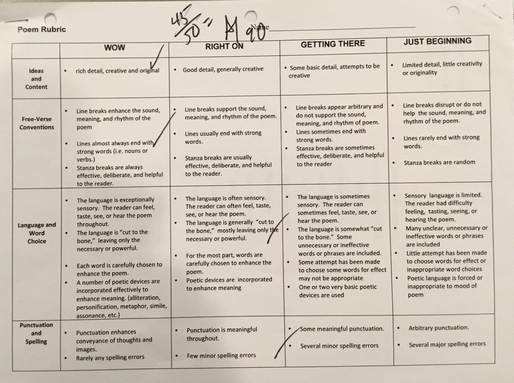

<!DOCTYPE html>
<html>
  <head>
      <link rel="stylesheet" href="style.css">
  </head>
    <a href="index.html"> Extras</a>
    <a href="Technology.html">Technology</a>
    <h1> Wesley Nesbitt; Portfolio</h1>

  <body>
      <h3>Smart Goal</h3>
      
      
 My smart goal for the year is to get an A+ on my future essays. I want to get A's because it will teach me how to write a good essay in high school.
    

      
      <h3>Stretch</h3>
      
   
 My stretch is to work on my outloud reading. This has been my strectch and I have been working on this stretch since the beginning of this school year. I have been trying to enhance my outloud reading by volunteering more to read in class. Doing this has definitly helped and I am noticing a difference in my reading.

      
      <h3>Strength</h3>
      
      
My strength is my good teamwork and collaboration. I work well with others and enjoy it more than working alone. an example of my good collaboration was during a spanish presentation, my partner did not memorize their lines and we had until the end of class for him to memorize it. I made sure to help him out and we stayed focused. We completed memorizing it and still managed to get a good grade.

      
      <h3>Social Studies</h3>
      
      
In Social Studies I have worked on my stretch by volunteering more to read and reading homework outloud. An example of how reading outloud helps me was when i got an A on a reading comprehension project called The Farewell. 

      
      
 This is an image of my Farewell Adress grade and front page.

       
      <h3>Literature</h3>
      
      
 In Literature I have worked on my stretch by reading the Scarlet Letter outloud, this has helped me to understand what went on in the book. So when I made my poem I understood what I needed to do to get a good grade and I got an A. 
      
      

      
      
      
      
This is two images of my poem and the grade I got which was an A.
      

      
      <h3> Spanish </h3>
      
      
 In spanish I have shown how I work with partners. I had a project my partner and I worked on and he did not memorize his parts. We had time to work on it during class and I focused and assumed a role of leadership. We ended up doing our project at the end of class and we did well and got a good grade.
          

          
      
 This is an imgage of my partner and I's script.

      <h3> Mathematics </h3>
     
In mathematics, my strength and stretch are not represented, but when taking notes in class I have done better on the work our class gets. 
      

      
      
 This is and image of some of the notes I took in math class.

      
      
 <link rel="stylesheet" href="style.css"><link rel="stylesheet" href="style.css">
    </body>
    
</html>
